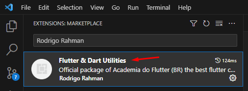
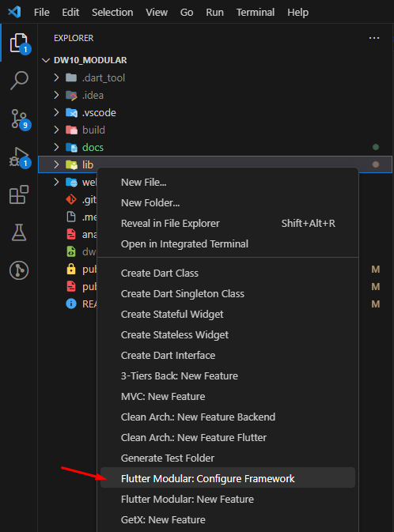

# dw10_modular

Pré Imersão Dart Week - Entendendo o Flutter Modular

## Comandos úteis

`flutter create --project-name dw10_modular --org br.com.academiaflutter --platforms web ./dw10_modular` criação do projeto

## Extensões necessárias

### Flutter & Dart Utilities

Utilizado para geração automática da estrutura do Flutter Modular no projeto:

