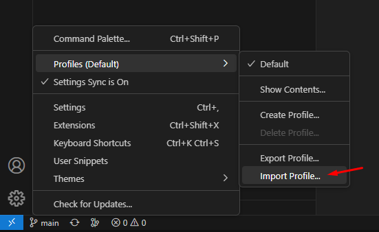
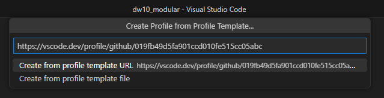
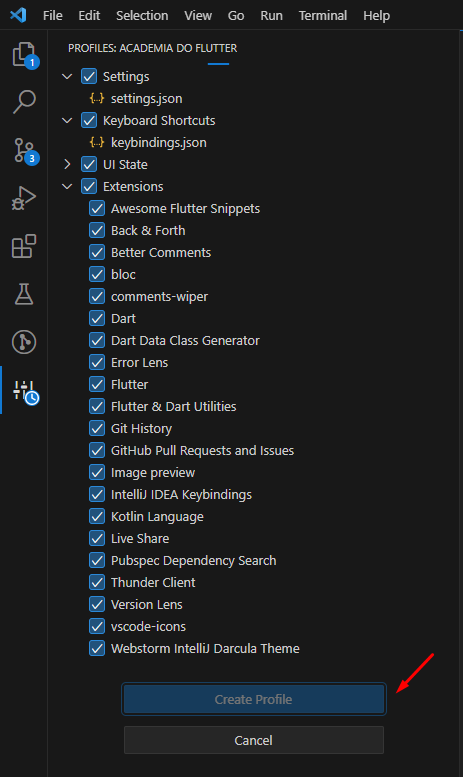
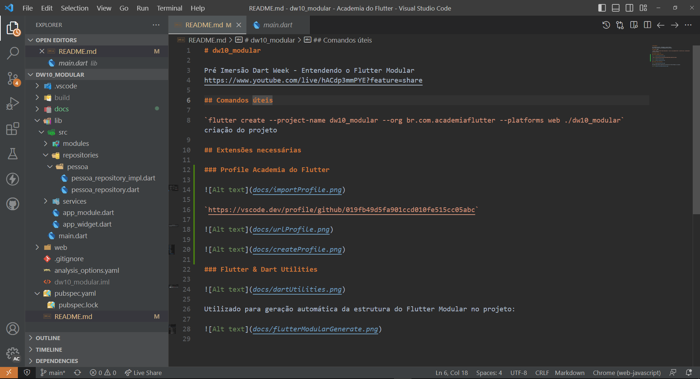

# dw10_modular

Pré Imersão Dart Week - Entendendo o Flutter Modular
https://www.youtube.com/live/hACdp3mmPYE?feature=share

## Comandos úteis

`flutter create --project-name dw10_modular --org br.com.academiaflutter --platforms web ./dw10_modular` criação do projeto

## Extensões necessárias

### Profile Academia do Flutter

`https://vscode.dev/profile/github/019fb49d5fa901ccd010fe515cc05abc`

### Flutter & Dart Utilities

Utilizado para geração automática da estrutura do Flutter Modular no projeto:

